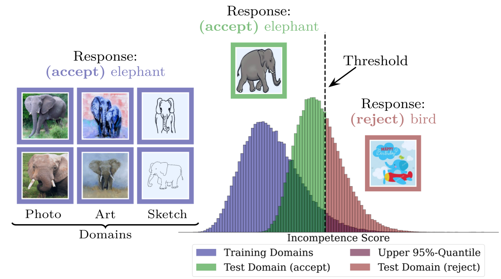

# Finding Competence Regions in Domain Generalization #



For a quick start take a look at the [Demo-Notebook](demo.ipynb) (make sure to install the packages as described below).


This repository contains the code for the article [Finding Competence Regions in Domain Generalization](https://openreview.net/forum?id=TSy0vuwQFN).

The article and the repository aim to explore failure case prediction in the Domain Generalization setting. It is equally applicable to the Supervised Learning setting.

# Requirements and Setup #

* The Code has been tested with Python 3.9
* A suitabble python environment can be installed with Minconda3 as follows
  *  `conda env create -f environment.yml`
  * ``conda activate comp``
  * ``pip install -e .``

# Data Preparation #

In this repository we do not require the data sets per se, but only the labels and the features/logits computed by a pre-trained classifier. For the ViM score we additonally need the weights and biases from the last layer. These files are stored as follows

* `{x}_id_train.npy` - `x` on training set; 
* `{x}_id_val.npy` - `x` on the (id) validation set
* `{x}_id_test.npy` - `x` on (id) test set
* `{x}_W.npy` - Weights of last layer
* `{x}_b.npy` - Biases of last layer

where `x = features, logits, labels`

And  similarly for out-of-distribution (OOD) samples:
* `{x}_ood.npy`- where `x = features, logits, labels`

For both `ood` and `id` data, features are of shape `(N,D)` where `N` is size of training data and `D` the dimension of the feature. Logits are of shape `(N,C)` where `C` is the amount of classes to predict. The labels have have the shape `(N,)`.

We provide for the standard classifier (ERM) features and logits computed on the `PACS` data set where the Art domain is considered to be the unseen test domain (i.e. data from test domain Art is out-of-distribution). The data can be stored in `data/PACS/test_env_0/` and downloaded via the following Python script
```
import gdown

url = 'https://drive.google.com/drive/folders/1q0OaXsU63C4VGsDoDIJcG0Eh1fDITgj4?usp=sharing'
output = 'data/PACS/test_env_0'

# Create folder if it does not exist
os.makedirs(output, exist_ok=True)

# download folder to directory
gdown.download_folder(url, output=output, quiet=True, use_cookies=False)
```


# Quick Start and Demo #

A short [demo notebook](`demo.ipynb`) shows how plots can be created for already compute scores and how new scores can be computed for a given pre-trained classifier. 


## Training ##

Scores can be computed as for instance via
```
python competence_estimation/main_scores.py --data_dir data --output_dir results --datasets PACS --algorithm ERM --test_domains 0 
```
Here we assume that logits, features, labels and network weights are given for PACS where the unknown test domain is domain 0. 
For more details `python competence_estimation/main_scores.py --help`

## Evaluation and Plots ##

Examples on the evaluation process are shown in `demo.ipynb`.
